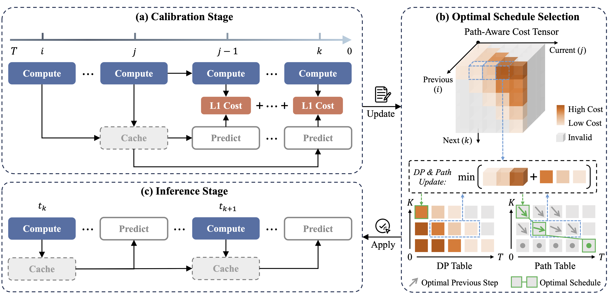

# [CVPR 2026] Denoising as Path Planning: Training-Free Acceleration of Diffusion Models with DPCache


<h5 align="center">

[](https://arxiv.org/abs/2602.22654) 
[](./LICENSE) 

</h5>

https://github.com/user-attachments/assets/d9a4f541-925f-47ef-b3d1-ec9b73f6357c

DPCache accelerates diffusion models via prediction-based caching, using dynamic programming with Path-Aware Cost Tensor (PACT) to optimize the caching schedule.


## ✨ Features

- **Efficient Caching**: Dynamic programming scheduling with Taylor expansion predictor
- **Path-Aware Cost Tensor**: 3D cost matrix for optimal step selection
- **Easy Adaptation**: Modular design with `CacheHelper` for quick integration
- **Reference Examples**: FLUX (text-to-image) and Wan2.1 (image-to-video) implementations


## 📰 News

- **[2025-03]** 🚀 Released with support for **FLUX** (text-to-image) and **Wan2.1** (image-to-video).
- **[2025-02]** 🎉 DPCache has been accepted to **CVPR 2026**!


## 🤖 Supported Models

| Model | Type | Reference Implementation |
|-------|------|------------------------|
| [FLUX.1-dev](https://huggingface.co/black-forest-labs/FLUX.1-dev) | Text-to-Image | [`dpcache_flux.py`](dpcache_flux.py) |
| [Wan2.1-I2V-14B-720P](https://huggingface.co/Wan-AI/Wan2.1-I2V-14B-720P-Diffusers) | Image-to-Video | [`dpcache_wan.py`](dpcache_wan.py) |


## 📋 Requirements

- Python 3.10+
- CUDA 12.0+ (recommended)
- Additional GPU memory is required during calibration

Install dependencies:
```bash
pip install -r requirements.txt
```

## 🚀 Quick Start

### Example 1: FLUX (Text-to-Image)

**Inference with pre-calibrated cost matrix:**
```bash
python dpcache_flux_infer.py --mode infer \
    --k 13 \
    --first_full_steps 3 \
    --dataset drawbench \
    --sample_size 100 \
    --output_path "flux_output"
```

**Calibration (generate custom cost matrix):**
```bash
python dpcache_flux_infer.py --mode calibrate \
    --cali_prefix "flux_calibration" \
    --dataset drawbench \
    --sample_rule fix \
    --sample_size 10 \
    --output_path "calibration_results"
```

This will generate a cost matrix file named `final_cost_matrix_flux_calibration.pkl`. Use it in inference via `--cost_matrix_path "final_cost_matrix_flux_calibration.pkl"`.


### Example 2: Wan2.1 (Image-to-Video)

**Inference with pre-calibrated cost matrix:**
```bash
python dpcache_wan_infer.py --mode infer \
    --image_path test.jpg \
    --prompt "a blue car driving down a dirt road near train tracks" \
    --k 12 
```

**Disable cache (baseline):**
```bash
python dpcache_wan_infer.py --mode infer --no_cache
```


## 🔧 Adapt to Your Own Model

DPCache can be integrated into other diffusion models. Follow these steps:

1. **Import CacheHelper** from `dpcache/cache_utils.py`
2. **Initialize cache** using `init_cache()` with your model's transformer blocks
3. **Wrap forward pass** using `CacheHelper` to manage caching logic (customize config as needed)
4. **Run calibration** to generate cost matrix for your specific model/config

By default, this repo uses **Taylor expansion-based predictors** (as in TaylorSeer), but **any other predictor** can be plugged in, as long as **the same predictor is used consistently in both calibration and inference**.

**Reference implementations:**
- [`dpcache_flux.py`](dpcache_flux.py)  - Integration with FLUX transformer blocks
- [`dpcache_wan.py`](dpcache_wan.py) - Integration with Wan2.1 transformer blocks

For adapting other diffusion models, please refer directly to the above files for how to:
- initialize cache with `init_cache`
- manage caching logic via `CacheHelper` in the main transformer forward
- cache or reuse block outputs inside each transformer block



## 📖 Citation

If you use this code, please cite:
```bibtex
@article{DPCache2026,
  title={Denoising as Path Planning: Training-Free Acceleration of Diffusion Models with DPCache},
  author={Cui, Bowen and Wang, Yuanbin and Xu, Huajiang and Chen, Biaolong and Zhang, Aixi and Jiang, Hao and Jin, Zhengzheng and Liu, Xu and Huang, Pipei},
  journal={arXiv preprint arXiv:2602.22654},
  year={2026}
}
```


## 🙏 Acknowledgements

This repository is built upon [Diffusers](https://github.com/huggingface/diffusers). We thank the following projects for their great work and contributions:

- **Models**: [FLUX](https://github.com/black-forest-labs/flux) by Black Forest Labs, [Wan2.1](https://github.com/Wan-Video/Wan2.1) by Wan-AI
- **Methods**: [TaylorSeer](https://github.com/Shenyi-Z/TaylorSeer) for Taylor expansion-based feature prediction
- **Datasets**: [DrawBench](https://huggingface.co/datasets/shunk031/DrawBench), [PartiPrompts](https://github.com/google-research/parti), [VBench](https://github.com/Vchitect/VBench) for quality evaluation
